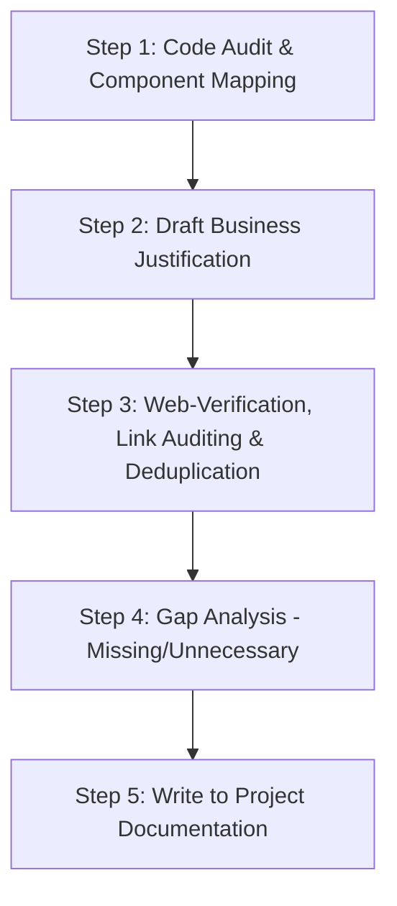

# Developer & Agent Audit Protocol: Dashboard Component Justification & Alignment

This document outlines the structured workflow and validation protocol that must be followed by developers and AI subagents when auditing, modifying, or creating components across the FMCG Portfolio Intelligence Dashboard.

---

## 📋 The Structured Audit Workflow

When auditing or modifying any dashboard tab, follow this five-step protocol:



### Step 1: Code Audit & Component Mapping
*   **Action:** Read the source code of the main tab component (e.g., `ExecutiveOverview.tsx`, `PortfolioHealthMap.tsx`).
*   **Task:** Identify and list every major visual widget, chart, KPI card, and modal container rendered on the screen.

### Step 2: Draft Business Justification
*   **Action:** Formulate the business necessity for each mapped component.
*   **Task:** Answer the "So What?": Why does an FMCG executive or category manager need to see this specific visualization or data subset? How does it help them make decisions?

### Step 3: Web-Verification, Link Auditing & Deduplication
*   **Action:** Search the web for recent, authoritative reports (McKinsey, BCG, Bain, Gartner, etc.) that support the data structure or design pattern.
*   **Task:** Use a specialized **browser agent** to click and check whether each proposed link is opening, confirming that the target URL loads successfully, is publicly accessible, and does not encounter 404 errors, homepage redirects, or login walls.
*   **Deduplication:** Ensure all selected supporting links are **unique** and not duplicated across other tabs or within the same tab (except for unique core baseline reports if absolutely necessary). If a duplicate link is identified, locate a unique alternative source.
*   **Semantic Correspondence:** Verify that the core content of the cited report directly aligns with and supports the specific row/component function (e.g., justify an assortment simulator with studies covering demand transference and substitution, rather than generic macro reports).
*   **Requirement:** Explicitly document the **Publication Date** (Month/Year) of each article to ensure relevance. Priority is given to recent (2024–2026) insights, or classic baseline reports when applicable.

### Step 4: Gap Analysis (Missing vs. Unnecessary)
*   **Action:** Evaluate the layout for both efficiency and clutter.
*   **Task:** 
    *   Identify **Missing Components** (e.g., standard FMCG KPIs like OTIF, or AI prescriptive action feeds).
    *   Identify **Unnecessary Components** (e.g., redundant chart toggles, vanity metrics that do not trigger operational decisions).

### Step 5: Write to Project Documentation
*   **Action:** Save the compiled justifications, verified links, and gap analyses into the project's `/documentation/` folder.
*   **Rule:** Keep documentation modular and structured tab-by-tab.

---

## 🤖 System Prompt Template for Subagents

Copy and use the following system prompt to delegate audits of other tabs to helper agents (such as the `research` or `browser` subagents):

```text
You are an expert FMCG Industry Consultant and Dashboard Developer. 
Your task is to audit [INSERT TAB NAME / NUMBER] of the portfolio dashboard.

Follow this audit protocol exactly:
1. Locate and read the source code file: [INSERT FILE PATH].
2. Identify all major visual/interactive components (KPI strips, charts, tables, filters, modals).
3. Draft a business justification for each component (why it is critical for FMCG category managers).
4. Find recent (2024–2026), public, and working articles from McKinsey, BCG, Bain, or Gartner supporting the metrics/decisions in each component.
5. Perform a **Semantic Correspondence Audit**: Double-check that the cited article's contents directly align with and justify the specific component function (e.g., do not cite general supply chain reports for a pricing or assortment simulator).
6. Use a browser agent to click and check whether the links are opening, confirming that the page content loads successfully and is publicly readable without paywalls, login screens, or 404 redirects.
7. Check for and resolve **link duplication**—ensure that all suggested links are unique and have not been used in other dashboard tab justifications.
8. Identify if there are any missing FMCG metrics (like OTIF) or unnecessary redundant widgets on this tab.
7. Return your findings in a clean markdown table matching this schema:
   | Component | Business Necessity | Recent External Justification | Publication Date | Verified Link |
```

---

## 📖 Reference Gold Standard (Tab 0 Example)

Use this structure as the reference standard for all subsequent tab documentation:

| Component | Function & Business Necessity | Recent External Justification | Publication Date | Verified Source & URL |
| :--- | :--- | :--- | :--- | :--- |
| **Smart Alerts** | Automatically groups and flags critical SKU issues (stockouts, margin drops) with direct "Investigate" links. | Shifting operations from manual dashboard monitoring to automated exception-based management workflows improves decision velocity. | **February 2026** | [McKinsey: From Dashboards to Decisions](https://www.mckinsey.com/industries/retail/our-insights/from-dashboards-to-decisions-empowering-merchants-with-agentic-ai) |
