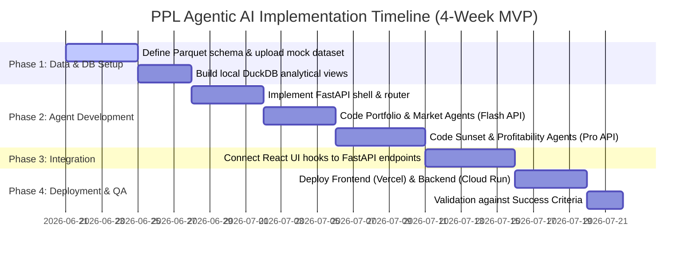

# Acies AgenticBus: Portfolio & Product Lifecycle Intelligence
## Architectural Proposal & Cost-Minimization Strategy

This document outlines the target architecture for the **Acies AgenticBus** platform (CPG/FMCG Portfolio and Product Lifecycle Intelligence) and provides a concrete roadmap for building and running the platform at the **lowest possible cost**.

---

## 1. Architectural Blueprint (The Agentic Bus)

To replace the manual, fragmented "As-Is" workflows (where data is scattered, reports are stale, and decisions take months) with the proactive "To-Be" state, we propose a modular, event-driven architecture. 

Rather than a monolithic application, the platform is divided into four clean layers: **Data Ingestion**, **Agentic Orchestration ("The Bus")**, **LLM Inference**, and **Presentation**.

```mermaid
graph TD
    %% Data Sources
    subgraph DataSources [Enterprise Systems]
        ERP[SAP / ERP Ledger]
        DP[Demand Planning Tool]
        SP[SharePoint PM Logs]
        Mkt[Market/Competitor Feeds]
    end

    %% Ingestion Layer
    subgraph DataLayer [Low-Cost Data Integration]
        Ingest[FastAPI / Python Ingestion Workers]
        S3[(AWS S3 / Parquet Store)]
        DuckDB[(DuckDB / PostgreSQL)]
    end

    %% Agentic Bus
    subgraph AgenticBus [Agentic Orchestration Layer]
        Orch[LangGraph Orchestrator / Event Router]
        
        PA[Portfolio Agent]
        LA[Launch Agent]
        PRA[Profitability Agent]
        SA[Sunset Agent]
        MSA[Market Signal Agent]
        
        BusState[(Shared State / Redis Cache)]
    end

    %% LLM Tier
    subgraph LLMTier [Hybrid LLM Inference Tier]
        Flash[Gemini 2.5 Flash / Llama-3-8B <br> Routine Tasks - 90%]
        Pro[Gemini 1.5 Pro / GPT-4o <br> Complex Simulations - 10%]
    end

    %% UI Layer
    subgraph UILayer [Presentation Layer]
        ReactUI[React 19 / TS Dashboard]
        API[FastAPI Gateway]
    end

    %% Data Flow Connections
    ERP --> Ingest
    DP --> Ingest
    SP --> Ingest
    Mkt --> Ingest
    
    Ingest --> S3
    S3 --> DuckDB
    
    %% Agent Connections
    DuckDB -.-> PA & LA & PRA & SA & MSA
    
    Orch --> PA & LA & PRA & SA & MSA
    PA & LA & PRA & SA & MSA <=> BusState
    
    PA & LA & PRA & SA & MSA <=> LLMTier
    
    %% UI Connections
    ReactUI <=> API
    API <=> Orch
    API -.-> DuckDB
```

### Layer Details

1. **Data Ingestion & Virtualization Layer (Storage & Querying)**
   * **Mechanism**: Lightweight Python workers run daily/weekly batch updates (or trigger-based push webhooks) to extract records from SAP/ERP, SharePoint updates, demand forecasts, and competitor API feeds.
   * **Storage**: Ingested data is serialized to flat, compressed **Parquet** files and uploaded to low-cost cloud storage (e.g., AWS S3 or Google Cloud Storage).
   * **Query Engine**: We use **DuckDB** (serverless analytical database) or a single hosted PostgreSQL database to run super-fast, low-cost analytical SQL queries directly on these Parquet files without requiring a dedicated, running cloud warehouse (like Snowflake or Redshift).

2. **Agentic Orchestration Layer (The "Agentic Bus")**
   * **Orchestration**: Built on **LangGraph** (stateful multi-agent graphs) or a custom event-driven Python microservice. The "Bus" acts as a shared state machine (stored in a lightweight Redis cache).
   * **The Agent Roster**:
     * **Portfolio Agent**: Periodically checks SKU performance boundaries. Generates structured alerts (e.g., SKU performance dropping >10% vs. target).
     * **Launch Agent**: Tracks the status of the 40+ launch readiness items across departments (market, supply chain, channel, pricing). Flags timeline bottlenecks.
     * **Profitability Agent**: Traverses the P&L tree and attributes cost-to-serve leakage based on logistics and promotion data.
     * **Sunset Agent**: Runs cannibalization simulations (substitution rates) and models complexity costs when a SKU sunset is triggered.
     * **Market Signal Agent**: Scrapes or processes competitor alerts and maps customer sentiment, flagging correlation risks to active products.

3. **Hybrid LLM Inference Tier**
   * **Concept**: Route LLM requests to different models based on complexity. Use structured JSON output formats to guarantee parsing success.
   * **Model Tiering**:
     * **Tier 1 (Fast & Cheap)**: Use **Gemini 2.5 Flash** or **Llama-3-8B** for structured data extraction, threshold evaluations, signal categorizations, and routine text summaries.
     * **Tier 2 (High Intelligence)**: Use **Gemini 1.5 Pro** or **GPT-4o** only when running full multi-agent scenario simulations (e.g., evaluating sunsetting the bottom 10% of SKUs across categories, estimating distribution transference, and drafting regional stakeholder talking points).

4. **Presentation & Application Layer**
   * **Frontend**: React 19, TypeScript, and Tailwind CSS (reusing the existing dashboard design).
   * **Hosting**: Hosted on **Vercel** or **AWS Amplify** (zero-cost static hosting tier).
   * **Visualization**: Client-side rendering of interactive charts using **Recharts**, avoiding BI tool licensing costs.

---

## 2. Lowest Cost Platform Development Strategy

To minimize cost during the **development (build)** phase, we focus on reusing code, open-source orchestration, and separating heavy math from language tasks.

### A. Leverage and Extend the Existing React Prototype
* The project already contains a premium, high-fidelity React frontend (`agentic_bus`) with mock data, CSS tokens, dark mode, responsive layouts, and modal interfaces. 
* **Action**: Do not rebuild the dashboard. Treat it as the final UI shell. Create a clean FastAPI back-end that implements the corresponding REST and WebSocket endpoints. Gradually swap out the mock state in `src/constants/data.ts` with live API fetches.

### B. Offload Mathematical Computation to Python (No LLM Math)
* LLMs are notoriously poor and highly expensive at doing math (e.g., calculating Gross Margin, COGS, substitution rates, or Pareto concentrations). Delegating arithmetic to an LLM wastes tokens and introduces hallucinations.
* **Action**: Implement all mathematical calculations (like the Profitability Tree roll-ups, cannibalization calculators, and portfolio complexity scoring) in **Python** using fast, open-source libraries like **Polars** or **Pandas**. Use the LLM *only* to interpret the results of these calculations and generate natural language reasoning ("So What?" insights and strategic recommendations).

### C. Use Open-Source Agent Orchestration
* Avoid commercial enterprise agent platforms that charge seat-licenses or execution overhead.
* **Action**: Write a simple Python event-routing mechanism or use **LangGraph** (open-source, stateful, cyclic graphs). A custom FastAPI router coordinating Python classes is often the most cost-effective and easiest to debug.

---

## 3. Lowest Cost Operational (Run) Strategy

Operating an AI platform can lead to ballooning cloud compute and API token bills. Here is how we run the platform at rock-bottom operational costs (under $50/month for a standard category deployment).

### A. Hybrid Model Tiering & Context Caching
* **Model Selection**: Route 90% of operational tasks (e.g., scanning SharePoint files, parsing daily competitor news, generating routine alerts) to **Gemini 2.5 Flash** (via Google AI Studio/Vertex AI) or **Double-digit-billion parameters open models** (via DeepInfra or Groq). At current pricing:
  * Gemini 2.5 Flash: ~$0.075 per 1M input tokens.
  * Gemini 1.5 Pro: ~$1.25 per 1M input tokens.
  * **Saving**: Routing to Flash is **94% cheaper** per execution.
* **Context Caching**: For the 10% of high-reasoning tasks handled by Gemini 1.5 Pro (like portfolio-wide rationalization scenario reviews), utilize **Gemini Context Caching**. Cache the static SKU catalog, historical baseline data, and the agent's system rules. 
  * **Saving**: Subsequent requests only pay the cache-read fee, which reduces input costs by up to **75%**.

### B. Event-Driven serverless Execution
* Instead of running a VM (such as an AWS EC2 instance) 24/7, deploy the back-end services using **Serverless Containers** (AWS Lambda, GCP Cloud Run, or Vercel Serverless Functions).
* **Action**: The API and the agent microservices spin down to zero when not in use. They trigger and execute only when:
  1. A user logs in and requests a live simulation.
  2. A scheduled Cron job runs (e.g., once a day at midnight to process new sales data and competitor feeds).
* **Saving**: Eliminates idle server charges.

### C. Serverless Data Virtualization (S3 + DuckDB)
* Setting up a running cloud data warehouse (like Snowflake) costs a minimum of $250/month in idle compute clusters.
* **Action**: Store all transaction logs, supply chain capacities, and competitor history as compressed **Parquet** files in AWS S3 (costing pennies/GB). Use **DuckDB** inside the serverless execution container to query the Parquet files directly. DuckDB compiles and runs analytical queries (aggregations, joins) at near-instant speeds with zero active server costs.

### D. Token-Thrifty Prompt Engineering & Local Vector Search
* Avoid sending the entire product directory (240+ SKUs with full attributes) in the prompt context of every agent run.
* **Action**: 
  * Implement a lightweight, local vector search using **ChromaDB** or **Faiss** (which run in-memory within the Python application, costing $0).
  * When a competitor signal is received (e.g., *"Competitor launches new orange juice variant"*), search the local vector index for the top 5 most similar SKUs in the category. 
  * Pass *only* these 5 relevant SKUs to the LLM to assess cannibalization risk, rather than the entire 240-SKU catalog. This reduces prompt sizes from ~50,000 tokens to under ~2,000 tokens.

---

## 4. Cost Comparison Matrix (Standard vs. Cost-Optimized)

The following table compares the monthly operating cost of a standard enterprise implementation against our proposed cost-optimized approach:

| Cost Category | Standard Enterprise Architecture | Low-Cost Proposed Architecture | Monthly Savings |
| :--- | :--- | :--- | :--- |
| **Data Warehouse** | Snowflake (Always-on cluster) <br> **~$250 / month** | AWS S3 + Parquet + DuckDB <br> **~$1 / month** (Storage only) | **$249 / month** |
| **Backend Servers** | Dedicated AWS EC2 instance (24/7) <br> **~$70 / month** | AWS Lambda / GCP Cloud Run <br> **~$5 / month** (Scale-to-zero) | **$65 / month** |
| **API BI Licenses** | Tableau / PowerBI Embedded <br> **~$150 / month** | Open-source React UI (Recharts) <br> **$0 / month** | **$150 / month** |
| **LLM Inference** | Raw GPT-4o / Gemini Pro for all tasks <br> **~$180 / month** | Hybrid Tiering (90% Flash / 10% Pro) + Caching <br> **~$15 / month** | **$165 / month** |
| **Agent Orchestrator**| Commercial Agent SaaS platform <br> **~$100 / month** | LangGraph (Open Source, self-hosted) <br> **$0 / month** | **$100 / month** |
| **TOTAL** | **~$750 / month** | **~$22 / month** | **~$728 / month (97% Cost Reduction)** |

---

## 5. Implementation Roadmap (Fastest Path to MVP)



1. **Week 1: Data Schema & Local Virtualization**
   * Structure database tables for Products, Margins, Competitor Logs, and Launch Gates.
   * Write Python scripts to clean and convert Excel/CSV files into Parquet format. Validate analytical DuckDB SQL queries.
2. **Week 2: Backend & Agent Service Layer**
   * Set up a FastAPI server with endpoints for alerts, simulation runs, and P&L adjustments.
   * Integrate Gemini 2.5 Flash and configure JSON-structured schema responses for alerts and segmentations.
3. **Week 3: Frontend Integration & State Sync**
   * Replace React's in-memory mock states with asynchronous API calls to the FastAPI backend.
   * Implement real-time WebSockets for alert streaming on the Executive Overview page.
4. **Week 4: Deployment & Verification**
   * Deploy the static React bundle to Vercel and the FastAPI app to GCP Cloud Run.
   * Verify all 5 success criteria metrics (e.g., manual consolidation time under 30 minutes, 15% SKU productivity simulation accuracy).
