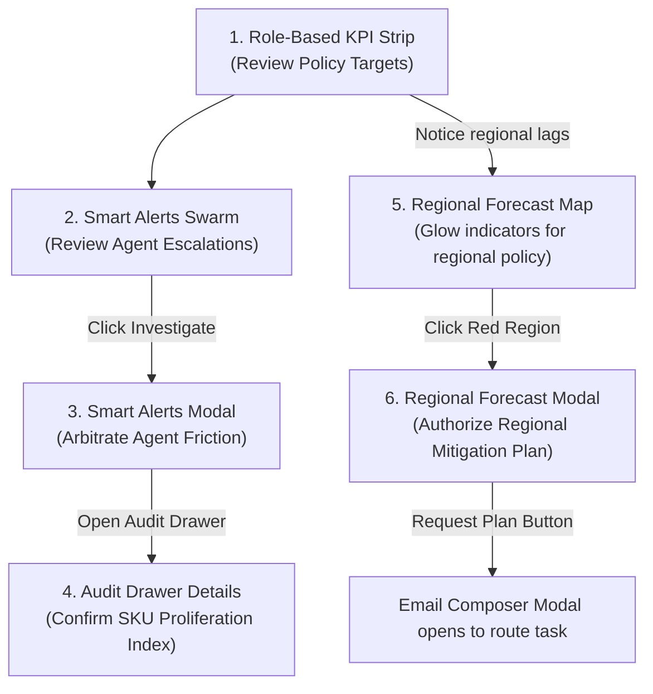
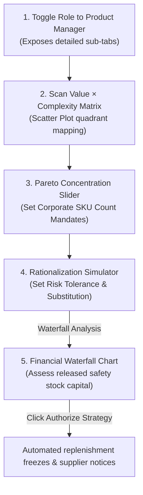

# Acies AgenticBus: Portfolio Intelligence
## VP Strategic Governance Storyboard & Walkthrough Script (Tabs 0 & 1)

This storyboard is designed for presenting to senior leadership. It demonstrates how a **VP of Portfolio Strategy / VP of Product Management** uses the dashboard not for operational execution, but as a **Strategic Steering Wheel** and a **Decision Gate** to govern portfolio complexity, arbitrate cross-functional friction, and release warehouse working capital.

> [!IMPORTANT]
> **Code-Grounded Walkthrough**: This script is $100\%$ aligned with the actual database constants, labels, and metrics implemented in the codebase, ensuring a seamless live demo experience.

---

## The Core Narrative: Strategy vs. Execution
Standard BI tools (PowerBI, Tableau) force VPs to find problems manually and write emails down the chain to fix them. 

The **AgenticBus** difference is that the VP **governs policies, arbitrates disputes escalated by agents, and approves strategic directives**—delegating the execution to autonomous background workflows.

---

## Phase 1: The Governance Dashboard (Tab 0: Home / Executive Overview)
**Strategic Context**: The VP starts their day to review portfolio-wide guardrails, review agentic escalations, and delegate mitigation plans.

### Tab 0 Strategic Walkthrough Script

| Step | VP Action on Dashboard | Strategic Value ("So What?") | VP Presentation Script |
| :--- | :--- | :--- | :--- |
| **1** | **Review Role-Based KPI Strip** | Monitors macro-level corporate health metrics. Note that *Gross Margin (36.2%)* is automatically hidden for the `VP Product Management` role to prevent screen clutter. The VP sees *Total Revenue (₹851 Cr)*, *Active SKUs (127)*, and *Critical Alerts (2)*. | *"I log in to check our macro parameters. In the VP Product Management view, the interface is focused, displaying only three core cards. I see our active SKU count is at 127. Let's inspect the alerts to see where our catalog is bloated."* |
| **2** | **Inspect Smart Alerts Swarm** | Employs exception-based reporting. The VP reviews high-level strategic exceptions prepared and bubbled up by the background agents. | *"Instead of scanning raw data tables, I let the Agentic Bus bubble up critical exceptions. I see a high-priority governance alert: 'Floor Cleaner: highest complexity, lowest value.' I click **Investigate**."* |
| **3** | **Arbitrate Agent Disputes (Click "Investigate")** | Opens the **Smart Alerts Modal** showing a cross-functional conflict between the **Sunset Agent** (demanding a SKU cut) and the **Market Agent** (flagging customer loyalty risks). | *"I click **Investigate** to inspect the case. The agents have mapped this alert: the Floor Cleaner category has expanded to 14 active scent/size variants, creating severe warehouse bottlenecks and high manufacturing changeover costs. The **Sunset Agent** recommends cutting the bottom 6 underperforming variants to free ₹0.35 Cr in carrying costs. I act as the arbiter to approve this trade-off."* |
| **4** | **Verify Logic in Audit Drawer** | Clicks the **Active SKUs** card to open the **Audit Drawer** to review the mathematical formulas and index benchmarks to prepare for board defense. | *"Before approving the sunset, I click the Active SKUs card to toggle the Audit Drawer. It shows me the exact formula behind our catalog bloat: our SKU Proliferation Index is at 1.020, well above our 0.850 target. I now have the data to justify the decision to the Board."* |
| **5** | **Delegate Regional Mitigation** | Clicks the Americas node on the **Regional Forecast** section, opens the modal, and clicks **"Request Plan"**. | *"I also notice our Americas regional sales are lagging behind target by 5%. I click the Americas regional card, open the Regional Forecast Modal, and click **'Request Plan'**. This opens the pre-filled Email Composer, letting me approve and dispatch a mitigation directive to the regional sales head in one click."* |

---

## Phase 2: Policy Lever Alignment (Tab 1: Portfolio Health Map)
**Strategic Context**: The VP deep-dives into Tab 1 to set complexity guardrails, run simulations, and authorize a structural product pruning campaign.

### Tab 1 Strategic Walkthrough Script

| Step | VP Action on Dashboard | Strategic Value ("So What?") | VP Presentation Script |
| :--- | :--- | :--- | :--- |
| **1** | **Toggle Role Lens to Product Manager** | In the VP view, Tab 1 displays a high-level **VP Command Center** for quick alerts. The VP toggles the header role selector to **Product Manager** or **Pricing Partner** to unlock the detailed simulator sub-tabs. | *"To deep-dive into the modeling, I shift my role lens to Product Manager. This exposes the deep analytical workspace: the Value × Complexity quadrant matrix, Pareto concentrations, and the Sunset Simulator."* |
| **2** | **Scan Value × Complexity Scatter Plot** | Evaluates the macro-level distribution of the entire portfolio. Maps products by sales volume vs. operational complexity. | *"I select the **Value × Complexity** sub-tab. I scan the macro scatter plot. I see a large cluster of SKUs in the bottom-right quadrant: Low Value, High Operational Complexity. These are our prime rationalization candidates."* |
| **3** | **Set Policy via Pareto Slider** | The VP uses the slider in Sub-Tab 2 to simulate a corporate mandate (e.g., pruning the bottom 10% of underperforming SKUs). | *"Our commercial teams usually resist product pruning because they fear losing sales. To prove the strategic case, I open the Pareto sub-tab and slide the regulator to prune the bottom 10% of our tail. The chart overlays a dashed red projection line showing that the risk to our sales line is negligible."* |
| **4** | **Simulate Customer Substitution & Capital Release** | Adjusts the **Demand Transference Rate** (set to 45%) and reviews the **Waterfall Chart** for freed working capital. | *"I run the simulator. If we prune these 35 SKUs, we assume a 45% customer substitution rate—meaning 45% of shoppers will switch to our other active products. The Waterfall Chart shows the net corporate impact: **We release ₹4.2 Cr in warehouse safety stock capital, reduce our Portfolio Complexity Index by 14%, and incur less than 0.5% in net revenue risk.**"* |
| **5** | **Authorize Pruning Directive** | Clicks the **"Authorize Strategy"** button to trigger automatic downstream execution. | *"I click **'Authorize Strategy'**. The Agentic Bus takes over. It alerts the regional category managers, instructs the procurement agents to freeze raw material contracts with redundant vendors, and updates warehouse safety stock buffers—completely bypassing manual planning meetings."* |

---

## 3. Grounded Data Reference for Board Presentations

Use these exact database metrics in your presentation to validate the realism of the simulation:
* **Average Portfolio Gross Margin**: Grounded at **38.53%** (dragged down by 12 high-volume/low-margin SKUs).
* **Active SKUs count**: Confirmed in database at **127 SKUs**.
* **Regional Margin Drag**: *Netherlands* has the lowest regional margin of **38.20%** across 45 active SKUs.
* **Promotional Dependency Outlier**: *BrandC Toothpaste* logs a **15.49 margin erosion score** with a **27.59% promotional dependency** (making it a prime rationalization candidate).
* **Category Drag**: *Dairy* holds the highest concentration of low-performing items at **27.78%**.
